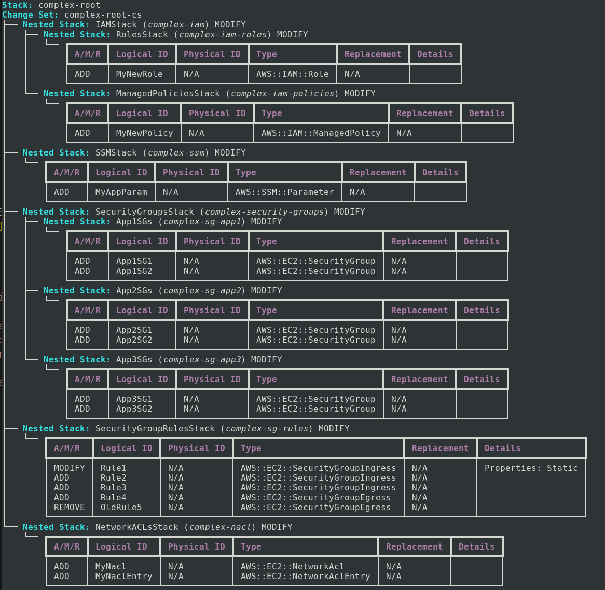

# CloudFormation ChangeSet Explorer

A tool query AWS CloudFormation ChangeSets and visualise it various formats.

- JSON
- YAML
- Text
- Markdown
- Mermaid
- Pretty (default)

**Example (default)**

<kbd></kbd>

## Installation

```bash
git clone https://github.com/gbudge/cfn-describe-changeset
cd cfn-describe-changeset
pip install .
```

>[!Note]
>A PyPi package is coming.

## Usage

```bash
user@vm:~/cfn-changeset-explorer $ ./cfn_changeset_explorer.sh --help
usage: main.py [-h] --stack-name NAME --cs-name NAME [--region REGION] [--output FORMAT] [--no-nested] [--mocked-json PATH]

Visualise AWS CloudFormation change sets in various formats.

options:
  -h, --help          show this help message and exit
  --stack-name NAME   The name or ID of the stack.
  --cs-name NAME      The name or ID of the change set.
  --region REGION     The AWS region (default: ap-southeast-2).
  --output FORMAT     The output format (default: pretty)
  --no-nested         Disable recursion into nested stacks.
  --mocked-json PATH  Path to a directory with mocked JSON responses.
user@vm:~/cfn-changeset-explorer $
```

## Demonstration

See the [docs/DEMO.md](docs/DEMO.md) file for examples of each format.

## License

See the [LICENSE.md](./LICENSE.md)
