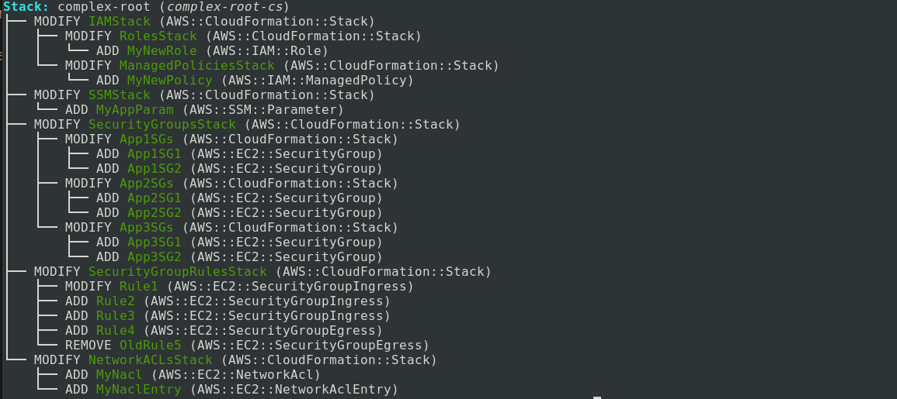

```mermaid
graph LR
  subgraph stack_complexroot ["complex-root"]
    stack_complexroot_IAMStack["IAMStack<br/>(AWS::CloudFormation::Stack)<br/>MODIFY"]
    stack_complexroot_SSMStack["SSMStack<br/>(AWS::CloudFormation::Stack)<br/>MODIFY"]
    stack_complexroot_SecurityGroupsStack["SecurityGroupsStack<br/>(AWS::CloudFormation::Stack)<br/>MODIFY"]
    stack_complexroot_SecurityGroupRulesStack["SecurityGroupRulesStack<br/>(AWS::CloudFormation::Stack)<br/>MODIFY"]
    stack_complexroot_NetworkACLsStack["NetworkACLsStack<br/>(AWS::CloudFormation::Stack)<br/>MODIFY"]
  end
    stack_complexroot_IAMStack --> stack_complexroot_IAMStack_complexiam_RolesStack
    stack_complexroot_IAMStack --> stack_complexroot_IAMStack_complexiam_ManagedPoliciesStack
    stack_complexroot_SSMStack --> stack_complexroot_SSMStack_complexssm_MyAppParam
    stack_complexroot_SecurityGroupsStack --> stack_complexroot_SecurityGroupsStack_complexsecuritygroups_App1SGs
    stack_complexroot_SecurityGroupsStack --> stack_complexroot_SecurityGroupsStack_complexsecuritygroups_App2SGs
    stack_complexroot_SecurityGroupsStack --> stack_complexroot_SecurityGroupsStack_complexsecuritygroups_App3SGs
    stack_complexroot_SecurityGroupRulesStack --> stack_complexroot_SecurityGroupRulesStack_complexsgrules_Rule1
    stack_complexroot_SecurityGroupRulesStack --> stack_complexroot_SecurityGroupRulesStack_complexsgrules_Rule2
    stack_complexroot_SecurityGroupRulesStack --> stack_complexroot_SecurityGroupRulesStack_complexsgrules_Rule3
    stack_complexroot_SecurityGroupRulesStack --> stack_complexroot_SecurityGroupRulesStack_complexsgrules_Rule4
    stack_complexroot_SecurityGroupRulesStack --> stack_complexroot_SecurityGroupRulesStack_complexsgrules_OldRule5
    stack_complexroot_NetworkACLsStack --> stack_complexroot_NetworkACLsStack_complexnacl_MyNacl
    stack_complexroot_NetworkACLsStack --> stack_complexroot_NetworkACLsStack_complexnacl_MyNaclEntry
  subgraph stack_complexroot_IAMStack_complexiam ["complex-iam"]
    stack_complexroot_IAMStack_complexiam_RolesStack["RolesStack<br/>(AWS::CloudFormation::Stack)<br/>MODIFY"]
    stack_complexroot_IAMStack_complexiam_ManagedPoliciesStack["ManagedPoliciesStack<br/>(AWS::CloudFormation::Stack)<br/>MODIFY"]
  end
    stack_complexroot_IAMStack_complexiam_RolesStack --> stack_complexroot_IAMStack_complexiam_RolesStack_complexiamroles_MyNewRole
    stack_complexroot_IAMStack_complexiam_ManagedPoliciesStack --> stack_complexroot_IAMStack_complexiam_ManagedPoliciesStack_complexiampolicies_MyNewPolicy
  subgraph stack_complexroot_IAMStack_complexiam_RolesStack_complexiamroles ["complex-iam-roles"]
    stack_complexroot_IAMStack_complexiam_RolesStack_complexiamroles_MyNewRole["MyNewRole<br/>(AWS::IAM::Role)<br/>ADD"]
  end
  subgraph stack_complexroot_IAMStack_complexiam_ManagedPoliciesStack_complexiampolicies ["complex-iam-policies"]
    stack_complexroot_IAMStack_complexiam_ManagedPoliciesStack_complexiampolicies_MyNewPolicy["MyNewPolicy<br/>(AWS::IAM::ManagedPolicy)<br/>ADD"]
  end
  subgraph stack_complexroot_SSMStack_complexssm ["complex-ssm"]
    stack_complexroot_SSMStack_complexssm_MyAppParam["MyAppParam<br/>(AWS::SSM::Parameter)<br/>ADD"]
  end
  subgraph stack_complexroot_SecurityGroupsStack_complexsecuritygroups ["complex-security-groups"]
    stack_complexroot_SecurityGroupsStack_complexsecuritygroups_App1SGs["App1SGs<br/>(AWS::CloudFormation::Stack)<br/>MODIFY"]
    stack_complexroot_SecurityGroupsStack_complexsecuritygroups_App2SGs["App2SGs<br/>(AWS::CloudFormation::Stack)<br/>MODIFY"]
    stack_complexroot_SecurityGroupsStack_complexsecuritygroups_App3SGs["App3SGs<br/>(AWS::CloudFormation::Stack)<br/>MODIFY"]
  end
    stack_complexroot_SecurityGroupsStack_complexsecuritygroups_App1SGs --> stack_complexroot_SecurityGroupsStack_complexsecuritygroups_App1SGs_complexsgapp1_App1SG1
    stack_complexroot_SecurityGroupsStack_complexsecuritygroups_App1SGs --> stack_complexroot_SecurityGroupsStack_complexsecuritygroups_App1SGs_complexsgapp1_App1SG2
    stack_complexroot_SecurityGroupsStack_complexsecuritygroups_App2SGs --> stack_complexroot_SecurityGroupsStack_complexsecuritygroups_App2SGs_complexsgapp2_App2SG1
    stack_complexroot_SecurityGroupsStack_complexsecuritygroups_App2SGs --> stack_complexroot_SecurityGroupsStack_complexsecuritygroups_App2SGs_complexsgapp2_App2SG2
    stack_complexroot_SecurityGroupsStack_complexsecuritygroups_App3SGs --> stack_complexroot_SecurityGroupsStack_complexsecuritygroups_App3SGs_complexsgapp3_App3SG1
    stack_complexroot_SecurityGroupsStack_complexsecuritygroups_App3SGs --> stack_complexroot_SecurityGroupsStack_complexsecuritygroups_App3SGs_complexsgapp3_App3SG2
  subgraph stack_complexroot_SecurityGroupsStack_complexsecuritygroups_App1SGs_complexsgapp1 ["complex-sg-app1"]
    stack_complexroot_SecurityGroupsStack_complexsecuritygroups_App1SGs_complexsgapp1_App1SG1["App1SG1<br/>(AWS::EC2::SecurityGroup)<br/>ADD"]
    stack_complexroot_SecurityGroupsStack_complexsecuritygroups_App1SGs_complexsgapp1_App1SG2["App1SG2<br/>(AWS::EC2::SecurityGroup)<br/>ADD"]
  end
  subgraph stack_complexroot_SecurityGroupsStack_complexsecuritygroups_App2SGs_complexsgapp2 ["complex-sg-app2"]
    stack_complexroot_SecurityGroupsStack_complexsecuritygroups_App2SGs_complexsgapp2_App2SG1["App2SG1<br/>(AWS::EC2::SecurityGroup)<br/>ADD"]
    stack_complexroot_SecurityGroupsStack_complexsecuritygroups_App2SGs_complexsgapp2_App2SG2["App2SG2<br/>(AWS::EC2::SecurityGroup)<br/>ADD"]
  end
  subgraph stack_complexroot_SecurityGroupsStack_complexsecuritygroups_App3SGs_complexsgapp3 ["complex-sg-app3"]
    stack_complexroot_SecurityGroupsStack_complexsecuritygroups_App3SGs_complexsgapp3_App3SG1["App3SG1<br/>(AWS::EC2::SecurityGroup)<br/>ADD"]
    stack_complexroot_SecurityGroupsStack_complexsecuritygroups_App3SGs_complexsgapp3_App3SG2["App3SG2<br/>(AWS::EC2::SecurityGroup)<br/>ADD"]
  end
  subgraph stack_complexroot_SecurityGroupRulesStack_complexsgrules ["complex-sg-rules"]
    stack_complexroot_SecurityGroupRulesStack_complexsgrules_Rule1["Rule1<br/>(AWS::EC2::SecurityGroupIngress)<br/>MODIFY"]
    stack_complexroot_SecurityGroupRulesStack_complexsgrules_Rule2["Rule2<br/>(AWS::EC2::SecurityGroupIngress)<br/>ADD"]
    stack_complexroot_SecurityGroupRulesStack_complexsgrules_Rule3["Rule3<br/>(AWS::EC2::SecurityGroupIngress)<br/>ADD"]
    stack_complexroot_SecurityGroupRulesStack_complexsgrules_Rule4["Rule4<br/>(AWS::EC2::SecurityGroupEgress)<br/>ADD"]
    stack_complexroot_SecurityGroupRulesStack_complexsgrules_OldRule5["OldRule5<br/>(AWS::EC2::SecurityGroupEgress)<br/>REMOVE"]
  end
  subgraph stack_complexroot_NetworkACLsStack_complexnacl ["complex-nacl"]
    stack_complexroot_NetworkACLsStack_complexnacl_MyNacl["MyNacl<br/>(AWS::EC2::NetworkAcl)<br/>ADD"]
    stack_complexroot_NetworkACLsStack_complexnacl_MyNaclEntry["MyNaclEntry<br/>(AWS::EC2::NetworkAclEntry)<br/>ADD"]
  end
```

# Examples

You can see several examples by running the `demo.sh` script too.

## Example of `pretty` (default)

```shell
./demo.sh

# OR

./demo.sh --output pretty
```

<kbd></kbd>

<br />
<br />

---

<br />
<br />

## Example of `ascii-tree`

```shell
./demo.sh --output ascii-tree
```

<kbd></kbd>

<br />
<br />

## Example of `aws-text`

```text
CHANGESET	arn:aws:cloudformation:us-west-2:123456789012:changeSet/complex-root-cs/00000000-0000-0000-0000-000000000000	arn:aws:cloudformation:us-west-2:123456789012:stack/complex-root/AAAAAAAA-AAAA-AAAA-AAAA-AAAAAAAAAAAA
RESOURCECHANGE	MODIFY	IAMStack	AWS::CloudFormation::Stack	None
  CHANGESET	arn:aws:cloudformation:us-west-2:123456789012:changeSet/complex-iam-cs/10000000-0000-0000-0000-000000000000	arn:aws:cloudformation:us-west-2:123456789012:stack/complex-iam/BBBBBBBB-BBBB-BBBB-BBBB-BBBBBBBBBBBB
  RESOURCECHANGE	MODIFY	RolesStack	AWS::CloudFormation::Stack	None
    CHANGESET	arn:aws:cloudformation:us-west-2:123456789012:changeSet/complex-iam-roles-cs/11000000-0000-0000-0000-000000000000	arn:aws:cloudformation:us-west-2:123456789012:stack/complex-iam-roles/CCCCCCCC-CCCC-CCCC-CCCC-CCCCCCCCCCCC
    RESOURCECHANGE	ADD	MyNewRole	AWS::IAM::Role	None
  RESOURCECHANGE	MODIFY	ManagedPoliciesStack	AWS::CloudFormation::Stack	None
    CHANGESET	arn:aws:cloudformation:us-west-2:123456789012:changeSet/complex-iam-policies-cs/12000000-0000-0000-0000-000000000000	arn:aws:cloudformation:us-west-2:123456789012:stack/complex-iam-policies/DDDDDDDD-DDDD-DDDD-DDDD-DDDDDDDDDDDD
    RESOURCECHANGE	ADD	MyNewPolicy	AWS::IAM::ManagedPolicy	None
RESOURCECHANGE	MODIFY	SSMStack	AWS::CloudFormation::Stack	None
  CHANGESET	arn:aws:cloudformation:us-west-2:123456789012:changeSet/complex-ssm-cs/20000000-0000-0000-0000-000000000000	arn:aws:cloudformation:us-west-2:123456789012:stack/complex-ssm/EEEEEEEE-EEEE-EEEE-EEEE-EEEEEEEEEEEE
  RESOURCECHANGE	ADD	MyAppParam	AWS::SSM::Parameter	None
RESOURCECHANGE	MODIFY	SecurityGroupsStack	AWS::CloudFormation::Stack	None
  CHANGESET	arn:aws:cloudformation:us-west-2:123456789012:changeSet/complex-sg-cs/30000000-0000-0000-0000-000000000000	arn:aws:cloudformation:us-west-2:123456789012:stack/complex-security-groups/FFFFFFFF-FFFF-FFFF-FFFF-FFFFFFFFFFFF
  RESOURCECHANGE	MODIFY	App1SGs	AWS::CloudFormation::Stack	None
    CHANGESET	arn:aws:cloudformation:us-west-2:123456789012:changeSet/complex-sg-app1-cs/31000000-0000-0000-0000-000000000000	arn:aws:cloudformation:us-west-2:123456789012:stack/complex-sg-app1/11111111-1111-1111-1111-111111111111
    RESOURCECHANGE	ADD	App1SG1	AWS::EC2::SecurityGroup	None
    RESOURCECHANGE	ADD	App1SG2	AWS::EC2::SecurityGroup	None
  RESOURCECHANGE	MODIFY	App2SGs	AWS::CloudFormation::Stack	None
    CHANGESET	arn:aws:cloudformation:us-west-2:123456789012:changeSet/complex-sg-app2-cs/32000000-0000-0000-0000-000000000000	arn:aws:cloudformation:us-west-2:123456789012:stack/complex-sg-app2/22222222-2222-2222-2222-222222222222
    RESOURCECHANGE	ADD	App2SG1	AWS::EC2::SecurityGroup	None
    RESOURCECHANGE	ADD	App2SG2	AWS::EC2::SecurityGroup	None
  RESOURCECHANGE	MODIFY	App3SGs	AWS::CloudFormation::Stack	None
    CHANGESET	arn:aws:cloudformation:us-west-2:123456789012:changeSet/complex-sg-app3-cs/33000000-0000-0000-0000-000000000000	arn:aws:cloudformation:us-west-2:123456789012:stack/complex-sg-app3/33333333-3333-3333-3333-333333333333
    RESOURCECHANGE	ADD	App3SG1	AWS::EC2::SecurityGroup	None
    RESOURCECHANGE	ADD	App3SG2	AWS::EC2::SecurityGroup	None
RESOURCECHANGE	MODIFY	SecurityGroupRulesStack	AWS::CloudFormation::Stack	None
  CHANGESET	arn:aws:cloudformation:us-west-2:123456789012:changeSet/complex-sg-rules-cs/40000000-0000-0000-0000-000000000000	arn:aws:cloudformation:us-west-2:123456789012:stack/complex-sg-rules/44444444-4444-4444-4444-444444444444
  RESOURCECHANGE	MODIFY	Rule1	AWS::EC2::SecurityGroupIngress	None
  RESOURCETARGET	Properties	CidrIp	Static
  RESOURCECHANGE	ADD	Rule2	AWS::EC2::SecurityGroupIngress	None
  RESOURCECHANGE	ADD	Rule3	AWS::EC2::SecurityGroupIngress	None
  RESOURCECHANGE	ADD	Rule4	AWS::EC2::SecurityGroupEgress	None
  RESOURCECHANGE	REMOVE	OldRule5	AWS::EC2::SecurityGroupEgress	None
RESOURCECHANGE	MODIFY	NetworkACLsStack	AWS::CloudFormation::Stack	None
  CHANGESET	arn:aws:cloudformation:us-west-2:123456789012:changeSet/complex-nacl-cs/50000000-0000-0000-0000-000000000000	arn:aws:cloudformation:us-west-2:123456789012:stack/complex-nacl/55555555-5555-5555-5555-555555555555
  RESOURCECHANGE	ADD	MyNacl	AWS::EC2::NetworkAcl	None
  RESOURCECHANGE	ADD	MyNaclEntry	AWS::EC2::NetworkAclEntry	None
```

<br />
<br />

## Example of `json`

```shell
./demo.sh --output json
```

```json
{
  "Changes": [
    {
      "Type": "Resource",
      "ResourceChange": {
        "Action": "Modify",
        "LogicalResourceId": "IAMStack",
        "PhysicalResourceId": "arn:aws:cloudformation:us-west-2:123456789012:stack/complex-iam/BBBBBBBB-BBBB-BBBB-BBBB-BBBBBBBBBBBB",
        "ResourceType": "AWS::CloudFormation::Stack",
        "ChangeSetId": "arn:aws:cloudformation:us-west-2:123456789012:changeSet/complex-iam-cs/10000000-0000-0000-0000-000000000000"
      }
    },
    {
      "Type": "Resource",
      "ResourceChange": {
        "Action": "Modify",
        "LogicalResourceId": "SSMStack",
        "PhysicalResourceId": "arn:aws:cloudformation:us-west-2:123456789012:stack/complex-ssm/EEEEEEEE-EEEE-EEEE-EEEE-EEEEEEEEEEEE",
        "ResourceType": "AWS::CloudFormation::Stack",
        "ChangeSetId": "arn:aws:cloudformation:us-west-2:123456789012:changeSet/complex-ssm-cs/20000000-0000-0000-0000-000000000000"
      }
    },
    {
      "Type": "Resource",
      "ResourceChange": {
        "Action": "Modify",
        "LogicalResourceId": "SecurityGroupsStack",
        "PhysicalResourceId": "arn:aws:cloudformation:us-west-2:123456789012:stack/complex-security-groups/FFFFFFFF-FFFF-FFFF-FFFF-FFFFFFFFFFFF",
        "ResourceType": "AWS::CloudFormation::Stack",
        "ChangeSetId": "arn:aws:cloudformation:us-west-2:123456789012:changeSet/complex-sg-cs/30000000-0000-0000-0000-000000000000"
      }
    },
    {
      "Type": "Resource",
      "ResourceChange": {
        "Action": "Modify",
        "LogicalResourceId": "SecurityGroupRulesStack",
        "PhysicalResourceId": "arn:aws:cloudformation:us-west-2:123456789012:stack/complex-sg-rules/44444444-4444-4444-4444-444444444444",
        "ResourceType": "AWS::CloudFormation::Stack",
        "ChangeSetId": "arn:aws:cloudformation:us-west-2:123456789012:changeSet/complex-sg-rules-cs/40000000-0000-0000-0000-000000000000"
      }
    },
    {
      "Type": "Resource",
      "ResourceChange": {
        "Action": "Modify",
        "LogicalResourceId": "NetworkACLsStack",
        "PhysicalResourceId": "arn:aws:cloudformation:us-west-2:123456789012:stack/complex-nacl/55555555-5555-5555-5555-555555555555",
        "ResourceType": "AWS::CloudFormation::Stack",
        "ChangeSetId": "arn:aws:cloudformation:us-west-2:123456789012:changeSet/complex-nacl-cs/50000000-0000-0000-0000-000000000000"
      }
    }
  ],
  "ChangeSetName": "complex-root-cs",
  "ChangeSetId": "arn:aws:cloudformation:us-west-2:123456789012:changeSet/complex-root-cs/00000000-0000-0000-0000-000000000000",
  "StackName": "complex-root",
  "StackId": "arn:aws:cloudformation:us-west-2:123456789012:stack/complex-root/AAAAAAAA-AAAA-AAAA-AAAA-AAAAAAAAAAAA",
  "ParentChangeSetId": null,
  "RootChangeSetId": null,
  "Status": "CREATE_COMPLETE",
  "ExecutionStatus": "AVAILABLE",
  "NestedChanges": [
    {
      "LogicalResourceId": "IAMStack",
      "ChangeSet": {
        "Changes": [
          {
            "Type": "Resource",
            "ResourceChange": {
              "Action": "Modify",
              "LogicalResourceId": "RolesStack",
              "PhysicalResourceId": "arn:aws:cloudformation:us-west-2:123456789012:stack/complex-iam-roles/CCCCCCCC-CCCC-CCCC-CCCC-CCCCCCCCCCCC",
              "ResourceType": "AWS::CloudFormation::Stack",
              "ChangeSetId": "arn:aws:cloudformation:us-west-2:123456789012:changeSet/complex-iam-roles-cs/11000000-0000-0000-0000-000000000000"
            }
          },
          {
            "Type": "Resource",
            "ResourceChange": {
              "Action": "Modify",
              "LogicalResourceId": "ManagedPoliciesStack",
              "PhysicalResourceId": "arn:aws:cloudformation:us-west-2:123456789012:stack/complex-iam-policies/DDDDDDDD-DDDD-DDDD-DDDD-DDDDDDDDDDDD",
              "ResourceType": "AWS::CloudFormation::Stack",
              "ChangeSetId": "arn:aws:cloudformation:us-west-2:123456789012:changeSet/complex-iam-policies-cs/12000000-0000-0000-0000-000000000000"
            }
          }
        ],
        "ChangeSetName": "complex-iam-cs",
        "ChangeSetId": "arn:aws:cloudformation:us-west-2:123456789012:changeSet/complex-iam-cs/10000000-0000-0000-0000-000000000000",
        "StackName": "complex-iam",
        "StackId": "arn:aws:cloudformation:us-west-2:123456789012:stack/complex-iam/BBBBBBBB-BBBB-BBBB-BBBB-BBBBBBBBBBBB",
        "ParentChangeSetId": "arn:aws:cloudformation:us-west-2:123456789012:changeSet/complex-root-cs/00000000-0000-0000-0000-000000000000",
        "RootChangeSetId": "arn:aws:cloudformation:us-west-2:123456789012:changeSet/complex-root-cs/00000000-0000-0000-0000-000000000000",
        "Status": "CREATE_COMPLETE",
        "ExecutionStatus": "UNAVAILABLE",
        "NestedChanges": [
          {
            "LogicalResourceId": "RolesStack",
            "ChangeSet": {
              "Changes": [
                {
                  "Type": "Resource",
                  "ResourceChange": {
                    "Action": "Add",
                    "LogicalResourceId": "MyNewRole",
                    "ResourceType": "AWS::IAM::Role"
                  }
                }
              ],
              "ChangeSetName": "complex-iam-roles-cs",
              "ChangeSetId": "arn:aws:cloudformation:us-west-2:123456789012:changeSet/complex-iam-roles-cs/11000000-0000-0000-0000-000000000000",
              "StackName": "complex-iam-roles",
              "StackId": "arn:aws:cloudformation:us-west-2:123456789012:stack/complex-iam-roles/CCCCCCCC-CCCC-CCCC-CCCC-CCCCCCCCCCCC",
              "ParentChangeSetId": "arn:aws:cloudformation:us-west-2:123456789012:changeSet/complex-iam-cs/10000000-0000-0000-0000-000000000000",
              "RootChangeSetId": "arn:aws:cloudformation:us-west-2:123456789012:changeSet/complex-root-cs/00000000-0000-0000-0000-000000000000",
              "Status": "CREATE_COMPLETE",
              "ExecutionStatus": "UNAVAILABLE"
            }
          },
          {
            "LogicalResourceId": "ManagedPoliciesStack",
            "ChangeSet": {
              "Changes": [
                {
                  "Type": "Resource",
                  "ResourceChange": {
                    "Action": "Add",
                    "LogicalResourceId": "MyNewPolicy",
                    "ResourceType": "AWS::IAM::ManagedPolicy"
                  }
                }
              ],
              "ChangeSetName": "complex-iam-policies-cs",
              "ChangeSetId": "arn:aws:cloudformation:us-west-2:123456789012:changeSet/complex-iam-policies-cs/12000000-0000-0000-0000-000000000000",
              "StackName": "complex-iam-policies",
              "StackId": "arn:aws:cloudformation:us-west-2:123456789012:stack/complex-iam-policies/DDDDDDDD-DDDD-DDDD-DDDD-DDDDDDDDDDDD",
              "ParentChangeSetId": "arn:aws:cloudformation:us-west-2:123456789012:changeSet/complex-iam-cs/10000000-0000-0000-0000-000000000000",
              "RootChangeSetId": "arn:aws:cloudformation:us-west-2:123456789012:changeSet/complex-root-cs/00000000-0000-0000-0000-000000000000",
              "Status": "CREATE_COMPLETE",
              "ExecutionStatus": "UNAVAILABLE"
            }
          }
        ]
      }
    },
    {
      "LogicalResourceId": "SSMStack",
      "ChangeSet": {
        "Changes": [
          {
            "Type": "Resource",
            "ResourceChange": {
              "Action": "Add",
              "LogicalResourceId": "MyAppParam",
              "ResourceType": "AWS::SSM::Parameter"
            }
          }
        ],
        "ChangeSetName": "complex-ssm-cs",
        "ChangeSetId": "arn:aws:cloudformation:us-west-2:123456789012:changeSet/complex-ssm-cs/20000000-0000-0000-0000-000000000000",
        "StackName": "complex-ssm",
        "StackId": "arn:aws:cloudformation:us-west-2:123456789012:stack/complex-ssm/EEEEEEEE-EEEE-EEEE-EEEE-EEEEEEEEEEEE",
        "ParentChangeSetId": "arn:aws:cloudformation:us-west-2:123456789012:changeSet/complex-root-cs/00000000-0000-0000-0000-000000000000",
        "RootChangeSetId": "arn:aws:cloudformation:us-west-2:123456789012:changeSet/complex-root-cs/00000000-0000-0000-0000-000000000000",
        "Status": "CREATE_COMPLETE",
        "ExecutionStatus": "UNAVAILABLE"
      }
    },
    {
      "LogicalResourceId": "SecurityGroupsStack",
      "ChangeSet": {
        "Changes": [
          {
            "Type": "Resource",
            "ResourceChange": {
              "Action": "Modify",
              "LogicalResourceId": "App1SGs",
              "PhysicalResourceId": "arn:aws:cloudformation:us-west-2:123456789012:stack/complex-sg-app1/11111111-1111-1111-1111-111111111111",
              "ResourceType": "AWS::CloudFormation::Stack",
              "ChangeSetId": "arn:aws:cloudformation:us-west-2:123456789012:changeSet/complex-sg-app1-cs/31000000-0000-0000-0000-000000000000"
            }
          },
          {
            "Type": "Resource",
            "ResourceChange": {
              "Action": "Modify",
              "LogicalResourceId": "App2SGs",
              "PhysicalResourceId": "arn:aws:cloudformation:us-west-2:123456789012:stack/complex-sg-app2/22222222-2222-2222-2222-222222222222",
              "ResourceType": "AWS::CloudFormation::Stack",
              "ChangeSetId": "arn:aws:cloudformation:us-west-2:123456789012:changeSet/complex-sg-app2-cs/32000000-0000-0000-0000-000000000000"
            }
          },
          {
            "Type": "Resource",
            "ResourceChange": {
              "Action": "Modify",
              "LogicalResourceId": "App3SGs",
              "PhysicalResourceId": "arn:aws:cloudformation:us-west-2:123456789012:stack/complex-sg-app3/33333333-3333-3333-3333-333333333333",
              "ResourceType": "AWS::CloudFormation::Stack",
              "ChangeSetId": "arn:aws:cloudformation:us-west-2:123456789012:changeSet/complex-sg-app3-cs/33000000-0000-0000-0000-000000000000"
            }
          }
        ],
        "ChangeSetName": "complex-sg-cs",
        "ChangeSetId": "arn:aws:cloudformation:us-west-2:123456789012:changeSet/complex-sg-cs/30000000-0000-0000-0000-000000000000",
        "StackName": "complex-security-groups",
        "StackId": "arn:aws:cloudformation:us-west-2:123456789012:stack/complex-security-groups/FFFFFFFF-FFFF-FFFF-FFFF-FFFFFFFFFFFF",
        "ParentChangeSetId": "arn:aws:cloudformation:us-west-2:123456789012:changeSet/complex-root-cs/00000000-0000-0000-0000-000000000000",
        "RootChangeSetId": "arn:aws:cloudformation:us-west-2:123456789012:changeSet/complex-root-cs/00000000-0000-0000-0000-000000000000",
        "Status": "CREATE_COMPLETE",
        "ExecutionStatus": "UNAVAILABLE",
        "NestedChanges": [
          {
            "LogicalResourceId": "App1SGs",
            "ChangeSet": {
              "Changes": [
                {
                  "Type": "Resource",
                  "ResourceChange": {
                    "Action": "Add",
                    "LogicalResourceId": "App1SG1",
                    "ResourceType": "AWS::EC2::SecurityGroup"
                  }
                },
                {
                  "Type": "Resource",
                  "ResourceChange": {
                    "Action": "Add",
                    "LogicalResourceId": "App1SG2",
                    "ResourceType": "AWS::EC2::SecurityGroup"
                  }
                }
              ],
              "ChangeSetName": "complex-sg-app1-cs",
              "ChangeSetId": "arn:aws:cloudformation:us-west-2:123456789012:changeSet/complex-sg-app1-cs/31000000-0000-0000-0000-000000000000",
              "StackName": "complex-sg-app1",
              "StackId": "arn:aws:cloudformation:us-west-2:123456789012:stack/complex-sg-app1/11111111-1111-1111-1111-111111111111",
              "ParentChangeSetId": "arn:aws:cloudformation:us-west-2:123456789012:changeSet/complex-sg-cs/30000000-0000-0000-0000-000000000000",
              "RootChangeSetId": "arn:aws:cloudformation:us-west-2:123456789012:changeSet/complex-root-cs/00000000-0000-0000-0000-000000000000",
              "Status": "CREATE_COMPLETE",
              "ExecutionStatus": "UNAVAILABLE"
            }
          },
          {
            "LogicalResourceId": "App2SGs",
            "ChangeSet": {
              "Changes": [
                {
                  "Type": "Resource",
                  "ResourceChange": {
                    "Action": "Add",
                    "LogicalResourceId": "App2SG1",
                    "ResourceType": "AWS::EC2::SecurityGroup"
                  }
                },
                {
                  "Type": "Resource",
                  "ResourceChange": {
                    "Action": "Add",
                    "LogicalResourceId": "App2SG2",
                    "ResourceType": "AWS::EC2::SecurityGroup"
                  }
                }
              ],
              "ChangeSetName": "complex-sg-app2-cs",
              "ChangeSetId": "arn:aws:cloudformation:us-west-2:123456789012:changeSet/complex-sg-app2-cs/32000000-0000-0000-0000-000000000000",
              "StackName": "complex-sg-app2",
              "StackId": "arn:aws:cloudformation:us-west-2:123456789012:stack/complex-sg-app2/22222222-2222-2222-2222-222222222222",
              "ParentChangeSetId": "arn:aws:cloudformation:us-west-2:123456789012:changeSet/complex-sg-cs/30000000-0000-0000-0000-000000000000",
              "RootChangeSetId": "arn:aws:cloudformation:us-west-2:123456789012:changeSet/complex-root-cs/00000000-0000-0000-0000-000000000000",
              "Status": "CREATE_COMPLETE",
              "ExecutionStatus": "UNAVAILABLE"
            }
          },
          {
            "LogicalResourceId": "App3SGs",
            "ChangeSet": {
              "Changes": [
                {
                  "Type": "Resource",
                  "ResourceChange": {
                    "Action": "Add",
                    "LogicalResourceId": "App3SG1",
                    "ResourceType": "AWS::EC2::SecurityGroup"
                  }
                },
                {
                  "Type": "Resource",
                  "ResourceChange": {
                    "Action": "Add",
                    "LogicalResourceId": "App3SG2",
                    "ResourceType": "AWS::EC2::SecurityGroup"
                  }
                }
              ],
              "ChangeSetName": "complex-sg-app3-cs",
              "ChangeSetId": "arn:aws:cloudformation:us-west-2:123456789012:changeSet/complex-sg-app3-cs/33000000-0000-0000-0000-000000000000",
              "StackName": "complex-sg-app3",
              "StackId": "arn:aws:cloudformation:us-west-2:123456789012:stack/complex-sg-app3/33333333-3333-3333-3333-333333333333",
              "ParentChangeSetId": "arn:aws:cloudformation:us-west-2:123456789012:changeSet/complex-sg-cs/30000000-0000-0000-0000-000000000000",
              "RootChangeSetId": "arn:aws:cloudformation:us-west-2:123456789012:changeSet/complex-root-cs/00000000-0000-0000-0000-000000000000",
              "Status": "CREATE_COMPLETE",
              "ExecutionStatus": "UNAVAILABLE"
            }
          }
        ]
      }
    },
    {
      "LogicalResourceId": "SecurityGroupRulesStack",
      "ChangeSet": {
        "Changes": [
          {
            "Type": "Resource",
            "ResourceChange": {
              "Action": "Modify",
              "LogicalResourceId": "Rule1",
              "ResourceType": "AWS::EC2::SecurityGroupIngress",
              "Details": [
                {
                  "Target": {
                    "Attribute": "Properties",
                    "Name": "CidrIp"
                  },
                  "Evaluation": "Static"
                }
              ]
            }
          },
          {
            "Type": "Resource",
            "ResourceChange": {
              "Action": "Add",
              "LogicalResourceId": "Rule2",
              "ResourceType": "AWS::EC2::SecurityGroupIngress"
            }
          },
          {
            "Type": "Resource",
            "ResourceChange": {
              "Action": "Add",
              "LogicalResourceId": "Rule3",
              "ResourceType": "AWS::EC2::SecurityGroupIngress"
            }
          },
          {
            "Type": "Resource",
            "ResourceChange": {
              "Action": "Add",
              "LogicalResourceId": "Rule4",
              "ResourceType": "AWS::EC2::SecurityGroupEgress"
            }
          },
          {
            "Type": "Resource",
            "ResourceChange": {
              "Action": "Remove",
              "LogicalResourceId": "OldRule5",
              "ResourceType": "AWS::EC2::SecurityGroupEgress"
            }
          }
        ],
        "ChangeSetName": "complex-sg-rules-cs",
        "ChangeSetId": "arn:aws:cloudformation:us-west-2:123456789012:changeSet/complex-sg-rules-cs/40000000-0000-0000-0000-000000000000",
        "StackName": "complex-sg-rules",
        "StackId": "arn:aws:cloudformation:us-west-2:123456789012:stack/complex-sg-rules/44444444-4444-4444-4444-444444444444",
        "ParentChangeSetId": "arn:aws:cloudformation:us-west-2:123456789012:changeSet/complex-root-cs/00000000-0000-0000-0000-000000000000",
        "RootChangeSetId": "arn:aws:cloudformation:us-west-2:123456789012:changeSet/complex-root-cs/00000000-0000-0000-0000-000000000000",
        "Status": "CREATE_COMPLETE",
        "ExecutionStatus": "UNAVAILABLE"
      }
    },
    {
      "LogicalResourceId": "NetworkACLsStack",
      "ChangeSet": {
        "Changes": [
          {
            "Type": "Resource",
            "ResourceChange": {
              "Action": "Add",
              "LogicalResourceId": "MyNacl",
              "ResourceType": "AWS::EC2::NetworkAcl"
            }
          },
          {
            "Type": "Resource",
            "ResourceChange": {
              "Action": "Add",
              "LogicalResourceId": "MyNaclEntry",
              "ResourceType": "AWS::EC2::NetworkAclEntry"
            }
          }
        ],
        "ChangeSetName": "complex-nacl-cs",
        "ChangeSetId": "arn:aws:cloudformation:us-west-2:123456789012:changeSet/complex-nacl-cs/50000000-0000-0000-0000-000000000000",
        "StackName": "complex-nacl",
        "StackId": "arn:aws:cloudformation:us-west-2:123456789012:stack/complex-nacl/55555555-5555-5555-5555-555555555555",
        "ParentChangeSetId": "arn:aws:cloudformation:us-west-2:123456789012:changeSet/complex-root-cs/00000000-0000-0000-0000-000000000000",
        "RootChangeSetId": "arn:aws:cloudformation:us-west-2:123456789012:changeSet/complex-root-cs/00000000-0000-0000-0000-000000000000",
        "Status": "CREATE_COMPLETE",
        "ExecutionStatus": "UNAVAILABLE"
      }
    }
  ]
}
```

<br />
<br />

---

<br />
<br />

## Example of `yaml`

```shell
./demo.sh --output yaml
```

```yaml
ChangeSetId: arn:aws:cloudformation:us-west-2:123456789012:changeSet/complex-root-cs/00000000-0000-0000-0000-000000000000
ChangeSetName: complex-root-cs
Changes:
- ResourceChange:
    Action: Modify
    ChangeSetId: arn:aws:cloudformation:us-west-2:123456789012:changeSet/complex-iam-cs/10000000-0000-0000-0000-000000000000
    LogicalResourceId: IAMStack
    PhysicalResourceId: arn:aws:cloudformation:us-west-2:123456789012:stack/complex-iam/BBBBBBBB-BBBB-BBBB-BBBB-BBBBBBBBBBBB
    ResourceType: AWS::CloudFormation::Stack
  Type: Resource
- ResourceChange:
    Action: Modify
    ChangeSetId: arn:aws:cloudformation:us-west-2:123456789012:changeSet/complex-ssm-cs/20000000-0000-0000-0000-000000000000
    LogicalResourceId: SSMStack
    PhysicalResourceId: arn:aws:cloudformation:us-west-2:123456789012:stack/complex-ssm/EEEEEEEE-EEEE-EEEE-EEEE-EEEEEEEEEEEE
    ResourceType: AWS::CloudFormation::Stack
  Type: Resource
- ResourceChange:
    Action: Modify
    ChangeSetId: arn:aws:cloudformation:us-west-2:123456789012:changeSet/complex-sg-cs/30000000-0000-0000-0000-000000000000
    LogicalResourceId: SecurityGroupsStack
    PhysicalResourceId: arn:aws:cloudformation:us-west-2:123456789012:stack/complex-security-groups/FFFFFFFF-FFFF-FFFF-FFFF-FFFFFFFFFFFF
    ResourceType: AWS::CloudFormation::Stack
  Type: Resource
- ResourceChange:
    Action: Modify
    ChangeSetId: arn:aws:cloudformation:us-west-2:123456789012:changeSet/complex-sg-rules-cs/40000000-0000-0000-0000-000000000000
    LogicalResourceId: SecurityGroupRulesStack
    PhysicalResourceId: arn:aws:cloudformation:us-west-2:123456789012:stack/complex-sg-rules/44444444-4444-4444-4444-444444444444
    ResourceType: AWS::CloudFormation::Stack
  Type: Resource
- ResourceChange:
    Action: Modify
    ChangeSetId: arn:aws:cloudformation:us-west-2:123456789012:changeSet/complex-nacl-cs/50000000-0000-0000-0000-000000000000
    LogicalResourceId: NetworkACLsStack
    PhysicalResourceId: arn:aws:cloudformation:us-west-2:123456789012:stack/complex-nacl/55555555-5555-5555-5555-555555555555
    ResourceType: AWS::CloudFormation::Stack
  Type: Resource
ExecutionStatus: AVAILABLE
NestedChanges:
- ChangeSet:
    ChangeSetId: arn:aws:cloudformation:us-west-2:123456789012:changeSet/complex-iam-cs/10000000-0000-0000-0000-000000000000
    ChangeSetName: complex-iam-cs
    Changes:
    - ResourceChange:
        Action: Modify
        ChangeSetId: arn:aws:cloudformation:us-west-2:123456789012:changeSet/complex-iam-roles-cs/11000000-0000-0000-0000-000000000000
        LogicalResourceId: RolesStack
        PhysicalResourceId: arn:aws:cloudformation:us-west-2:123456789012:stack/complex-iam-roles/CCCCCCCC-CCCC-CCCC-CCCC-CCCCCCCCCCCC
        ResourceType: AWS::CloudFormation::Stack
      Type: Resource
    - ResourceChange:
        Action: Modify
        ChangeSetId: arn:aws:cloudformation:us-west-2:123456789012:changeSet/complex-iam-policies-cs/12000000-0000-0000-0000-000000000000
        LogicalResourceId: ManagedPoliciesStack
        PhysicalResourceId: arn:aws:cloudformation:us-west-2:123456789012:stack/complex-iam-policies/DDDDDDDD-DDDD-DDDD-DDDD-DDDDDDDDDDDD
        ResourceType: AWS::CloudFormation::Stack
      Type: Resource
    ExecutionStatus: UNAVAILABLE
    NestedChanges:
    - ChangeSet:
        ChangeSetId: arn:aws:cloudformation:us-west-2:123456789012:changeSet/complex-iam-roles-cs/11000000-0000-0000-0000-000000000000
        ChangeSetName: complex-iam-roles-cs
        Changes:
        - ResourceChange:
            Action: Add
            LogicalResourceId: MyNewRole
            ResourceType: AWS::IAM::Role
          Type: Resource
        ExecutionStatus: UNAVAILABLE
        ParentChangeSetId: arn:aws:cloudformation:us-west-2:123456789012:changeSet/complex-iam-cs/10000000-0000-0000-0000-000000000000
        RootChangeSetId: arn:aws:cloudformation:us-west-2:123456789012:changeSet/complex-root-cs/00000000-0000-0000-0000-000000000000
        StackId: arn:aws:cloudformation:us-west-2:123456789012:stack/complex-iam-roles/CCCCCCCC-CCCC-CCCC-CCCC-CCCCCCCCCCCC
        StackName: complex-iam-roles
        Status: CREATE_COMPLETE
      LogicalResourceId: RolesStack
    - ChangeSet:
        ChangeSetId: arn:aws:cloudformation:us-west-2:123456789012:changeSet/complex-iam-policies-cs/12000000-0000-0000-0000-000000000000
        ChangeSetName: complex-iam-policies-cs
        Changes:
        - ResourceChange:
            Action: Add
            LogicalResourceId: MyNewPolicy
            ResourceType: AWS::IAM::ManagedPolicy
          Type: Resource
        ExecutionStatus: UNAVAILABLE
        ParentChangeSetId: arn:aws:cloudformation:us-west-2:123456789012:changeSet/complex-iam-cs/10000000-0000-0000-0000-000000000000
        RootChangeSetId: arn:aws:cloudformation:us-west-2:123456789012:changeSet/complex-root-cs/00000000-0000-0000-0000-000000000000
        StackId: arn:aws:cloudformation:us-west-2:123456789012:stack/complex-iam-policies/DDDDDDDD-DDDD-DDDD-DDDD-DDDDDDDDDDDD
        StackName: complex-iam-policies
        Status: CREATE_COMPLETE
      LogicalResourceId: ManagedPoliciesStack
    ParentChangeSetId: arn:aws:cloudformation:us-west-2:123456789012:changeSet/complex-root-cs/00000000-0000-0000-0000-000000000000
    RootChangeSetId: arn:aws:cloudformation:us-west-2:123456789012:changeSet/complex-root-cs/00000000-0000-0000-0000-000000000000
    StackId: arn:aws:cloudformation:us-west-2:123456789012:stack/complex-iam/BBBBBBBB-BBBB-BBBB-BBBB-BBBBBBBBBBBB
    StackName: complex-iam
    Status: CREATE_COMPLETE
  LogicalResourceId: IAMStack
- ChangeSet:
    ChangeSetId: arn:aws:cloudformation:us-west-2:123456789012:changeSet/complex-ssm-cs/20000000-0000-0000-0000-000000000000
    ChangeSetName: complex-ssm-cs
    Changes:
    - ResourceChange:
        Action: Add
        LogicalResourceId: MyAppParam
        ResourceType: AWS::SSM::Parameter
      Type: Resource
    ExecutionStatus: UNAVAILABLE
    ParentChangeSetId: arn:aws:cloudformation:us-west-2:123456789012:changeSet/complex-root-cs/00000000-0000-0000-0000-000000000000
    RootChangeSetId: arn:aws:cloudformation:us-west-2:123456789012:changeSet/complex-root-cs/00000000-0000-0000-0000-000000000000
    StackId: arn:aws:cloudformation:us-west-2:123456789012:stack/complex-ssm/EEEEEEEE-EEEE-EEEE-EEEE-EEEEEEEEEEEE
    StackName: complex-ssm
    Status: CREATE_COMPLETE
  LogicalResourceId: SSMStack
- ChangeSet:
    ChangeSetId: arn:aws:cloudformation:us-west-2:123456789012:changeSet/complex-sg-cs/30000000-0000-0000-0000-000000000000
    ChangeSetName: complex-sg-cs
    Changes:
    - ResourceChange:
        Action: Modify
        ChangeSetId: arn:aws:cloudformation:us-west-2:123456789012:changeSet/complex-sg-app1-cs/31000000-0000-0000-0000-000000000000
        LogicalResourceId: App1SGs
        PhysicalResourceId: arn:aws:cloudformation:us-west-2:123456789012:stack/complex-sg-app1/11111111-1111-1111-1111-111111111111
        ResourceType: AWS::CloudFormation::Stack
      Type: Resource
    - ResourceChange:
        Action: Modify
        ChangeSetId: arn:aws:cloudformation:us-west-2:123456789012:changeSet/complex-sg-app2-cs/32000000-0000-0000-0000-000000000000
        LogicalResourceId: App2SGs
        PhysicalResourceId: arn:aws:cloudformation:us-west-2:123456789012:stack/complex-sg-app2/22222222-2222-2222-2222-222222222222
        ResourceType: AWS::CloudFormation::Stack
      Type: Resource
    - ResourceChange:
        Action: Modify
        ChangeSetId: arn:aws:cloudformation:us-west-2:123456789012:changeSet/complex-sg-app3-cs/33000000-0000-0000-0000-000000000000
        LogicalResourceId: App3SGs
        PhysicalResourceId: arn:aws:cloudformation:us-west-2:123456789012:stack/complex-sg-app3/33333333-3333-3333-3333-333333333333
        ResourceType: AWS::CloudFormation::Stack
      Type: Resource
    ExecutionStatus: UNAVAILABLE
    NestedChanges:
    - ChangeSet:
        ChangeSetId: arn:aws:cloudformation:us-west-2:123456789012:changeSet/complex-sg-app1-cs/31000000-0000-0000-0000-000000000000
        ChangeSetName: complex-sg-app1-cs
        Changes:
        - ResourceChange:
            Action: Add
            LogicalResourceId: App1SG1
            ResourceType: AWS::EC2::SecurityGroup
          Type: Resource
        - ResourceChange:
            Action: Add
            LogicalResourceId: App1SG2
            ResourceType: AWS::EC2::SecurityGroup
          Type: Resource
        ExecutionStatus: UNAVAILABLE
        ParentChangeSetId: arn:aws:cloudformation:us-west-2:123456789012:changeSet/complex-sg-cs/30000000-0000-0000-0000-000000000000
        RootChangeSetId: arn:aws:cloudformation:us-west-2:123456789012:changeSet/complex-root-cs/00000000-0000-0000-0000-000000000000
        StackId: arn:aws:cloudformation:us-west-2:123456789012:stack/complex-sg-app1/11111111-1111-1111-1111-111111111111
        StackName: complex-sg-app1
        Status: CREATE_COMPLETE
      LogicalResourceId: App1SGs
    - ChangeSet:
        ChangeSetId: arn:aws:cloudformation:us-west-2:123456789012:changeSet/complex-sg-app2-cs/32000000-0000-0000-0000-000000000000
        ChangeSetName: complex-sg-app2-cs
        Changes:
        - ResourceChange:
            Action: Add
            LogicalResourceId: App2SG1
            ResourceType: AWS::EC2::SecurityGroup
          Type: Resource
        - ResourceChange:
            Action: Add
            LogicalResourceId: App2SG2
            ResourceType: AWS::EC2::SecurityGroup
          Type: Resource
        ExecutionStatus: UNAVAILABLE
        ParentChangeSetId: arn:aws:cloudformation:us-west-2:123456789012:changeSet/complex-sg-cs/30000000-0000-0000-0000-000000000000
        RootChangeSetId: arn:aws:cloudformation:us-west-2:123456789012:changeSet/complex-root-cs/00000000-0000-0000-0000-000000000000
        StackId: arn:aws:cloudformation:us-west-2:123456789012:stack/complex-sg-app2/22222222-2222-2222-2222-222222222222
        StackName: complex-sg-app2
        Status: CREATE_COMPLETE
      LogicalResourceId: App2SGs
    - ChangeSet:
        ChangeSetId: arn:aws:cloudformation:us-west-2:123456789012:changeSet/complex-sg-app3-cs/33000000-0000-0000-0000-000000000000
        ChangeSetName: complex-sg-app3-cs
        Changes:
        - ResourceChange:
            Action: Add
            LogicalResourceId: App3SG1
            ResourceType: AWS::EC2::SecurityGroup
          Type: Resource
        - ResourceChange:
            Action: Add
            LogicalResourceId: App3SG2
            ResourceType: AWS::EC2::SecurityGroup
          Type: Resource
        ExecutionStatus: UNAVAILABLE
        ParentChangeSetId: arn:aws:cloudformation:us-west-2:123456789012:changeSet/complex-sg-cs/30000000-0000-0000-0000-000000000000
        RootChangeSetId: arn:aws:cloudformation:us-west-2:123456789012:changeSet/complex-root-cs/00000000-0000-0000-0000-000000000000
        StackId: arn:aws:cloudformation:us-west-2:123456789012:stack/complex-sg-app3/33333333-3333-3333-3333-333333333333
        StackName: complex-sg-app3
        Status: CREATE_COMPLETE
      LogicalResourceId: App3SGs
    ParentChangeSetId: arn:aws:cloudformation:us-west-2:123456789012:changeSet/complex-root-cs/00000000-0000-0000-0000-000000000000
    RootChangeSetId: arn:aws:cloudformation:us-west-2:123456789012:changeSet/complex-root-cs/00000000-0000-0000-0000-000000000000
    StackId: arn:aws:cloudformation:us-west-2:123456789012:stack/complex-security-groups/FFFFFFFF-FFFF-FFFF-FFFF-FFFFFFFFFFFF
    StackName: complex-security-groups
    Status: CREATE_COMPLETE
  LogicalResourceId: SecurityGroupsStack
- ChangeSet:
    ChangeSetId: arn:aws:cloudformation:us-west-2:123456789012:changeSet/complex-sg-rules-cs/40000000-0000-0000-0000-000000000000
    ChangeSetName: complex-sg-rules-cs
    Changes:
    - ResourceChange:
        Action: Modify
        Details:
        - Evaluation: Static
          Target:
            Attribute: Properties
            Name: CidrIp
        LogicalResourceId: Rule1
        ResourceType: AWS::EC2::SecurityGroupIngress
      Type: Resource
    - ResourceChange:
        Action: Add
        LogicalResourceId: Rule2
        ResourceType: AWS::EC2::SecurityGroupIngress
      Type: Resource
    - ResourceChange:
        Action: Add
        LogicalResourceId: Rule3
        ResourceType: AWS::EC2::SecurityGroupIngress
      Type: Resource
    - ResourceChange:
        Action: Add
        LogicalResourceId: Rule4
        ResourceType: AWS::EC2::SecurityGroupEgress
      Type: Resource
    - ResourceChange:
        Action: Remove
        LogicalResourceId: OldRule5
        ResourceType: AWS::EC2::SecurityGroupEgress
      Type: Resource
    ExecutionStatus: UNAVAILABLE
    ParentChangeSetId: arn:aws:cloudformation:us-west-2:123456789012:changeSet/complex-root-cs/00000000-0000-0000-0000-000000000000
    RootChangeSetId: arn:aws:cloudformation:us-west-2:123456789012:changeSet/complex-root-cs/00000000-0000-0000-0000-000000000000
    StackId: arn:aws:cloudformation:us-west-2:123456789012:stack/complex-sg-rules/44444444-4444-4444-4444-444444444444
    StackName: complex-sg-rules
    Status: CREATE_COMPLETE
  LogicalResourceId: SecurityGroupRulesStack
- ChangeSet:
    ChangeSetId: arn:aws:cloudformation:us-west-2:123456789012:changeSet/complex-nacl-cs/50000000-0000-0000-0000-000000000000
    ChangeSetName: complex-nacl-cs
    Changes:
    - ResourceChange:
        Action: Add
        LogicalResourceId: MyNacl
        ResourceType: AWS::EC2::NetworkAcl
      Type: Resource
    - ResourceChange:
        Action: Add
        LogicalResourceId: MyNaclEntry
        ResourceType: AWS::EC2::NetworkAclEntry
      Type: Resource
    ExecutionStatus: UNAVAILABLE
    ParentChangeSetId: arn:aws:cloudformation:us-west-2:123456789012:changeSet/complex-root-cs/00000000-0000-0000-0000-000000000000
    RootChangeSetId: arn:aws:cloudformation:us-west-2:123456789012:changeSet/complex-root-cs/00000000-0000-0000-0000-000000000000
    StackId: arn:aws:cloudformation:us-west-2:123456789012:stack/complex-nacl/55555555-5555-5555-5555-555555555555
    StackName: complex-nacl
    Status: CREATE_COMPLETE
  LogicalResourceId: NetworkACLsStack
ParentChangeSetId: null
RootChangeSetId: null
StackId: arn:aws:cloudformation:us-west-2:123456789012:stack/complex-root/AAAAAAAA-AAAA-AAAA-AAAA-AAAAAAAAAAAA
StackName: complex-root
Status: CREATE_COMPLETE
```

<br />
<br />

---

<br />
<br />

## Example of `mermaid`

```shell
./demo.sh --output mermaid
```

